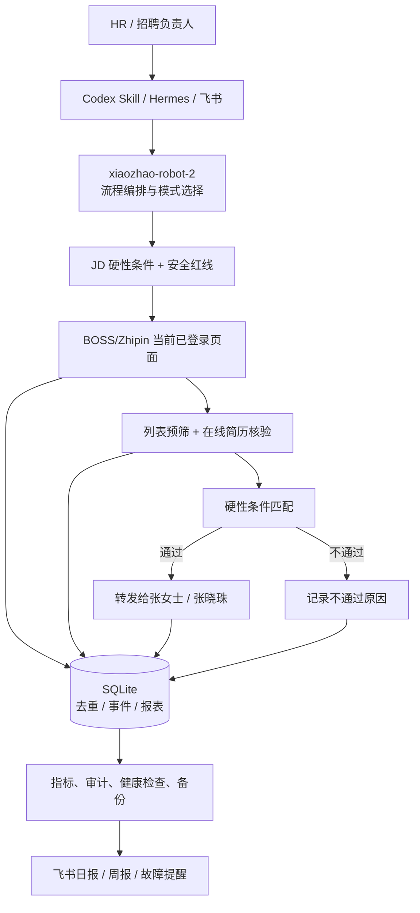
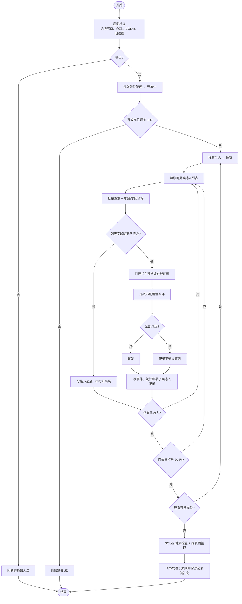

# 小昭招聘机器人 2.2

这是当前 BOSS/Zhipin HR 筛选流程的完整封装包。飞书/Hermes 侧运行时使用
`openai-codex / gpt-5.5`；本地 Codex 使用当前 Codex 会话和技能路径。


## 产品定位与设计原则

小昭招聘机器人是一个面向 BOSS/Zhipin 的**可控招聘工作台**：接收 HR 任务和 JD，按硬性条件筛选推荐候选人，保留可复核的最小记录，满足条件后转发，并通过 SQLite + 飞书输出可追溯报表。

- **角色**：HR 招聘助手，服务招聘负责人。
- **目标**：识别岗位、筛选候选人、根据硬性条件给出结论，必要时执行转发。
- **依据优先级**：用户 JD 库 > 在线简历直接证据 > 列表字段；没有直接证据不判定为满足。
- **固定输出**：`结论 / 依据 / 下一步`，并同步写入 SQLite 事件与统计。
- **安全边界**：不猜测政策、不承诺录用、不处理验证码或安全验证、不保存简历全文。

### 架构图



### 标准筛选流程图



> 详细的模式选择、分层职责、证据格式、六项治理能力和变更约定见 [`docs/architecture.md`](docs/architecture.md)。

## 包含内容

- `skills/`: Codex 侧技能，包括 `xiaozhao-robot-2` 和全部 Zhipin 子技能。
- `hermes/skills/business/xiaozhao-robot-2/`: Hermes 侧小昭招聘机器人2.2技能。
- `hermes/skill-bundles/xiaozhao-robot-2.yaml`: Hermes slash bundle，可用
  `/xiaozhao-robot-2` 加载。
- `.zhipin-copilot/recruitment.sqlite3`: 安装时在目标 workspace 自动初始化的
  SQLite 数据库。
- `automations/`: 当前 8 个自动化任务模板。
- `docs/`: 技能树和中文说明。
- `docs/architecture.md`: 项目架构、模式选择、筛选流程和治理能力。
- `docs/README.md`: 文档导航与 Mermaid 图源文件索引。
- `docs/daily-report-data-contract.md`: 日报/周报 SQLite 数据契约，定义所有报表字段的数据表来源和交叉校验规则。
- `bin/install.sh`: 安装到本机或目标机器，并自动初始化 SQLite。
- `bin/package-release.sh`: 生成 GitHub Release 使用的压缩包。
- `skills/zhipin-boss-recruitment-bot/scripts/report_metrics.py`: 只读 SQLite
  生成日报/周报聚合数据和正文。
- `skills/zhipin-boss-recruitment-bot/scripts/feishu_gateway.py`: 统一飞书
  OpenAPI 发送网关，内置网络预检、租户 token 获取和退避重试。
- `skills/zhipin-boss-recruitment-bot/scripts/report_feishu_sender.py`: 日报/周报
  补发入口，可直接发送 reports 表中 `PREPARED` 或 `FAILED` 的报告。

## Hermes 接入

飞书/Hermes Gateway 运行时应使用：

```text
provider=openai-codex
model=gpt-5.5
```

启动后在 Hermes 里使用：

```text
/xiaozhao-robot-2
```

或直接说明要执行“小昭招聘机器人2.2”的哪个流程。

本地 Codex 可直接指定：

```text
使用 xiaozhao-robot-2 执行日报流程，只读取 SQLite，不打开 BOSS
```

日报或周报如果因飞书网络抖动发送失败，报告正文仍保留在 SQLite `reports`
表中，状态为 `FAILED`。恢复网络后可以直接补发，不需要重新打开 BOSS：

```bash
python3 skills/zhipin-boss-recruitment-bot/scripts/report_feishu_sender.py --report-type daily --period-start 2026-06-11 --period-end 2026-06-11
```

## 数据规则

小昭招聘机器人2.2 只使用 SQLite 作为持久化数据源：

```text
.zhipin-copilot/recruitment.sqlite3
```

正常筛选不写 JSON/JSONL，不保存简历全文。候选人重复检查必须先查
`processed_candidates` 的规范化 `candidate_key`，不能依赖 BOSS 页面红点。
候选人持久化信息只保留二次查重必需的轻量字段：岗位、姓名、年龄、学历、求职期望/目标岗位、城市、薪资、工作年限。
遇到 `王先生` 这类同名或匿名候选人时，禁止只凭姓名判断重复，必须结合年龄、学历、期望、当前筛选岗位等字段复核。
每天必须记录并可交叉校验日报核心统计。日报数据是高优先级生产数据，绝对不能只依赖单表：

- 已处理候选人必须写入 `processed_candidates` 和 `daily_processed_candidates`；最终日报/周报人数以当前 SQLite 源表交叉校验后的列表读取/处理口径为准，`daily_processed_candidates` 只作补充校验。列表里年龄或学历明确不符合而未打开在线简历的候选人，也算已处理候选人。
- 成功转发人数必须按候选人去重合并 `forward_records.status=SUCCESS`、`processed_candidates.status='forwarded'`、`run_events` 中 `boss_forward_success` / `forward_success` / `boss_forward success`，避免某个写入路径漏表导致日报和飞书不一致。
- 重复候选人、列表预筛通过/弃选、打开在线简历、岗位总数据必须同时参考 `screening_run_seen_candidates`、`batch_list_prefilter` 事件、`online_resume_viewed/online_resume_view` 事件和 `processed_candidates`。
- 岗位日报必须展示岗位总数据、列表读取、重复、列表弃选、打开在线简历、入库候选人、转发、未转发。岗位总数据等于列表读取人数，不能再与打开在线简历相加；打开在线简历只是列表读取候选人的后续过程指标。
- 岗位不符合原因统计必须按候选人去重，优先使用 `processed_candidates` 最终状态和 note 作为主因；旧数据缺少最终原因时才回退 hard gate 事件。历史 `UNSUITABLE_REVIEW` 记录不计入“硬性条件通过并转发”。
- 打开在线简历后只记录 `online_resume_viewed` 事件用于查看数统计；不再保存完整在线简历信息到单独明细表，以保持筛选速度。

JD 使用用户提供的内置硬性要求库。每天只检查「职位管理 -> 开放中」是否出现
JD 库缺失岗位；正常流程不再打开 BOSS 岗位详情抓取或覆盖 JD。

## 数据库备份

小昭使用 SQLite 单库文件保存运行数据。为降低误删、磁盘异常、WAL 未合并或
迁移脚本写坏数据的风险，当前采用“本机备份 + 桌面备份”双份策略，不把真实
数据库提交到 GitHub。

备份命令：

```bash
python3 skills/zhipin-boss-recruitment-bot/scripts/sqlite_store.py --db data/.zhipin-copilot/recruitment.sqlite3 backup-create --label manual
```

默认会生成两份备份，且备份目录不得位于 `.codex`、`.hermes`、`~/.codex`
或 `~/.hermes` 路径下：

```text
data/backups/sqlite/
/Users/helloworld/Desktop/小昭机器人2.0/backups/sqlite/
```

每次备份会先执行 WAL checkpoint，再用 SQLite backup API 生成一致性副本；
备份后执行 `integrity_check`，并生成 `.sha256` 和 `.json` 元数据文件。

## 性能优化

小昭是单机串行 BOSS 自动化流程，核心数据以 SQLite 为准。当前 SQLite 已启用
WAL、busy timeout、内存临时表、较大的页缓存和常用统计/查重索引；推荐列表
批量预筛会批量查重，并把列表阶段筛掉的候选人合并提交，减少每屏候选人的
重复读写。候选人去重优先使用姓名、年龄、学历组成的轻量 fingerprint，
并保留求职期望、岗位、城市、薪资、工作年限用于二次查重，降低同名候选人被误判为重复的风险。

筛选速度相关优化：

- JD 硬性条件会通过 `seed-jd-hard-gates` / `get-jd-hard-gates` 转成
  SQLite `job_hard_gates` 缓存，岗位切换后只读一次结构化年龄、学历和 hard gate，
  不在每份简历上重复解析 JD 文本。列表阶段只允许判断年龄和学历是否符合；
  产品、地区、年限、语言、业务类型、工具/平台等其他硬性条件必须打开在线简历后
  再按 `decision_plan_json` 判断。
- `batch-list-prefilter` 对列表阶段年龄/学历不合格候选人执行批量写入和一次
  commit；候选人之间不额外执行健康检查，减少 SQLite 小事务和固定检查开销。
- 主流程取得 `automation_runs.run_id` 后，把它传给
  `batch-list-prefilter --run-id`，用 `screening_run_seen_candidates` 跳过本轮
  列表滚动中已经见过的候选人，减少重复查库、重复识别和误点风险。
  本轮 seen 缓存保留 14 天，启动新 run 时自动清理更早记录。
- 禁止通过缩放浏览器提速；不得调整浏览器缩放比例、页面缩放或显示比例来增加
  每屏候选人数量。

## 飞书功能

飞书群里机器人显示为 `@小昭`，所有命令需要先 @ 小昭。当前支持：

- 身份和帮助：`@小昭 /help`、`@小昭 你有什么功能`。
- 日报查询：`@小昭 /日报 2026/06/05`、`@小昭 昨天的日报`。
- 周报查询：`@小昭 /周报 2026/06/05`，覆盖该日期所在的周一到周日。
- 流程问答：可询问筛选规则、JD 硬性要求、转发规则、自动化配置、权限边界。
- JD 库维护：`@小昭 /jd 查看`、`@小昭 /jd 更新 <岗位名>`、`@小昭 /jd 新增 <岗位名>`、`@小昭 /jd 删除 <岗位名>`。
- 自动化流程：`@小昭 /自动化流程 查看`、`@小昭 /自动化流程 修改流程时间 <流程> <HH:MM>`、`@小昭 开始 boss-1流程`、`@小昭 停止 boss-1流程`。
- 工单记录：`@小昭 /bug ...`、`@小昭 /xq ...`、`@小昭 /bug 查看`、`@小昭 /xq 查看`、`@小昭 /bug 1`、`@小昭 /xq 1`。
- 工单流转：`@小昭 /close bug 1`、`@小昭 /close xq 1`、`@小昭 /cp bug 1`、`@小昭 /cp xq 1`。
- 反馈：`@小昭 反馈 ...` 会记录反馈并生成需求单。

普通问答、帮助和报表查询不会创建工单，也不会通知程序负责人。反馈、bug、xq
记录会写入 SQLite，并按规则通知相关人员。需求单完成时需要提交给钟苗验收，
通过后才标记为完成；不通过则回到未完成队列并通知程序负责人。

每天 09:00 还会生成一份未完成需求/Bug 合并报表，读取 SQLite 中未完成的
`xiaozhao_feishu_requirement_tickets` 和 `xiaozhao_feishu_bug_tickets`。

## 自动化任务

2.2 包内包含 8 个自动化任务模板，位于 `automations/`：

| 文件 | 任务 | 时间 | 说明 |
| --- | --- | --- | --- |
| `boss-1-workday-flow.toml` | 周一到周六筛选主流程 | 周一到周六 08:00 | 运行到 20:00，执行 BOSS 推荐牛人筛选主流程。 |
| `boss-2-sunday-flow.toml` | 周日筛选主流程 | 周日 19:00 | 运行到 21:00，星期六不执行。 |
| `boss-3-daily-report.toml` | 日报流程 | 每天 09:00 | 只读 SQLite，统计前一自然日工作日报并发送飞书。 |
| `boss-4-weekly-report.toml` | 周报流程 | 每周一 08:00 | 只读 SQLite，统计上周工作周报并发送飞书。 |
| `boss-5-daily-report-data-prep.toml` | 日报数据预整理 | 每天 23:00 | 只读/写 SQLite，整理当天日报聚合数据并写入 `reports`，不发送飞书。 |
| `boss-6-weekly-report-data-prep.toml` | 周报数据预整理 | 每周日 23:30 | 只读/写 SQLite，整理本周周报聚合数据并写入 `reports`，不发送飞书。 |
| `boss-7-sqlite-backup.toml` | SQLite 自动备份 | 每天 23:10 | 生成本机和桌面两份 SQLite 备份，校验 integrity 和 sha256。 |
| `xiaozhao-unfinished-tickets.toml` | 未完成工单日报 | 每天 09:00 | 汇总未完成需求/Bug，写入 `reports` 并飞书通知。 |

这些模板用于迁移或重建任务。安装脚本不会自动启用定时任务；在目标机器导入前，
需要把模板里的 workspace 路径改成目标机器实际路径，并确认 Feishu 密钥、
Chrome BOSS 登录态和 Codex 权限都已配置好。

模型分工：BOSS 主筛选、日报发送、周报发送等需要复杂判断或界面操作的流程使用
`gpt-5.5`；固定化检查/预整理任务（`boss-5`、`boss-6`、`boss-7`、未完成工单汇总模板）
使用 `gpt-5.4`。

### 自动化生命周期

所有自动化主流程都必须永久遵守“开工前先检查、收工后必清场”的规则：

- 浏览器控制优先使用 Codex 支持的 Chrome 插件控制用户现有 Google Chrome 会话；当 Chrome 插件不可用、被阻断或必须进行可见屏幕交互时，再使用 Computer Use。
  禁止使用 Chrome CDP、Chrome DevTools Protocol、remote debugging、
  `127.0.0.1:9222`、`/json/version`、隐藏浏览器会话或非 Codex 浏览器自动化库。
  CDP 不可用不是故障，不得阻止流程启动。
- 开始前先检查当前时间窗口、任务暂停状态、上一轮残留任务、SQLite 可用性、
  BOSS 登录态、页面健康和开放岗位 JD 库。
- 如果发现上一轮残留进程、数据库锁、未完成浏览器自动化、登录/验证/账号异常
  或歧义 UI，不开始筛选，先记录 blocker 并按故障规则通知。
- 结束前如果正在处理候选人，先完成当前候选人的读取、硬性条件检查、
  BOSS 转发或缺失记录。
- 收工前必须写入当天候选人、匹配、转发、处理记录、在线简历查看事件、
  run events 和日报/周报所需统计数据，确保第二日 09:00 日报和周一 08:00
  周报无需重新打开 BOSS 即可准时发送。
- 每天 23:00 必须执行日报数据预整理，只读/写 SQLite，不打开 BOSS，将当天
  工作日报聚合正文以 `sent_status=PREPARED` 写入 `reports`，确保第二天
  09:00 可准时发送。
- 每周日 23:30 必须执行周报数据预整理，只读/写 SQLite，不打开 BOSS，将本周
  工作周报聚合正文以 `sent_status=PREPARED` 写入 `reports`，确保周一 08:00
  可准时发送。
- 每天 23:10 必须执行 SQLite 自动备份，只读/写 SQLite 和备份目录，不打开 BOSS。
  备份必须同时写入本机 `data/backups/sqlite/` 和桌面
  `/Users/helloworld/Desktop/小昭机器人2.0/backups/sqlite/`，并校验 integrity
  与 sha256。备份目录禁止放在 Codex/Hermes 配置、技能、缓存或运行目录下。
  备份成功后必须发送“SQLite 自动备份成功”飞书通知，包含本机备份路径、桌面
  备份路径、integrity 和 sha256；该通知不是日报/周报。
- 自动化启动前和日报/周报发送前可执行当天心跳检查，确认 `boss-1`、`boss-2`、
  `boss-3`、`boss-4`、`xiaozhao-unfinished-tickets` 是否存在当天运行记录、
  是否仍在心跳、是否已正常完成。
- 自动化启动前和日报/周报发送前可执行 SQLite `health-check`，同时检查数据库
  integrity、关键表、WAL、当天候选人统计和自动化心跳状态。
- 收工后必须检查残留小昭/BOSS 自动化进程、子命令、未完成浏览器自动化、
  SQLite WAL/lock 和未关闭任务状态。
- 只停止明确属于本次小昭自动化的残留；不得停止无关浏览器、系统、Codex、
  Hermes 或用户进程。无法安全清理时，记录 blocker 并按故障规则通知。

### GPT 不可用风险提醒

如果 GPT/Codex/Hermes 主模型通道无法启动、认证失败、长时间无响应或被确认不可用，
不要继续启动 BOSS 自动筛选。先运行独立飞书风险提醒脚本通知程序/管理员：

```bash
python3 skills/zhipin-boss-recruitment-bot/scripts/risk_feishu_alert.py \
  --task "小昭/BOSS 自动化" \
  --reason "GPT/主模型通道无法使用"
```

该脚本直接调用飞书 OpenAPI，不依赖 GPT。可选参数
`--fallback-provider deepseek|minimax` 只用于在已配置可用密钥时生成简短补充说明；
如果 DeepSeekV4 Pro 或 MiniMax M3 不可用，脚本会自动退回固定告警文本并继续发送飞书。
当前生产流程不依赖 MiniMax M3，但本机 Hermes 已将 MiniMax M3 配置为备用 provider，
不改变 `openai-codex / gpt-5.5` 主模型。可用下面命令做 smoke test：

```bash
hermes -z '只回复：M3_OK' --provider minimax-cn --model MiniMax-M3 --ignore-rules
hermes -z '只回复：M3_OK' --provider minimax --model MiniMax-M3 --ignore-rules
```

若要启用 DeepSeekV4 Pro 作为可选补充，需要重新配置 `DEEPSEEK_API_KEY`。

为了避免 GPT/Codex 本身无法启动时无人触发告警，本机还提供独立 launchd 监控：

```bash
bin/install-gpt-codex-monitor.sh /Users/helloworld/Documents/小昭机器人
```

安装后 macOS 会每 5 分钟运行一次
`skills/zhipin-boss-recruitment-bot/scripts/gpt_codex_outage_monitor.py`。
监控连续 2 次检测到 GPT/Codex 核心通道异常后，直接通过飞书通知程序/管理员；
告警会明确提示先检查网络和 Codex。同类告警 60 分钟冷却一次，避免刷屏。日志写入
`~/.hermes/logs/xiaozhao_gpt_codex_monitor.log`，状态写入
`~/.hermes/state/xiaozhao_gpt_codex_monitor.json`。卸载命令：

```bash
bin/uninstall-gpt-codex-monitor.sh
```

日报/周报发送前必须先做 SQLite 报表就绪检查，并优先读取前一晚
`sent_status=PREPARED` 的预整理记录。数据缺失时，不打开 BOSS 补数据；
写出当前可用的最佳聚合报表，记录问题并按规则通知。日报/周报正文必须保持下方固定格式，
不要把自动化心跳概览追加到「运行时长与状态」里。

## 日报/周报格式

日报每天 09:00 统计前一自然日，周报每周一 08:00 统计上周一到上周日。
两类报告都只读 SQLite，不打开或操作 BOSS。正常日报/周报不 `@钟苗`；
只有登录异常、安全验证、流程故障、缺 JD、无法启动等阻断情况才真实
`@钟苗`。

日报/周报格式是固定对外格式，禁止擅自修改；任何格式、字段、顺序、标题、
措辞结构或额外信息的变更，都必须先获得用户明确批准。周报必须参考日报格式，
只把统计周期和措辞从“今日/日报”调整为“上周/周报”，不得另起结构。

日报固定格式：

```text
工作日报：
1. 运行状态与风控
- 运行时长与状态：今日运行状态：正常 / 存在中断/异常。（若存在中断/异常，需备注原因，如触发验证码等）
- Token消耗：累计消耗 Token XX

2. 任务完成度与简历质量
- 全局漏斗：今日共筛选候选人 X 位。其中硬性条件通过并转发 X 位，硬性条件缺失未转发 X 位。
- 重复候选人：X 位（历史重复 X 位，同轮重复 X 位）
- 筛选过程全量统计：列表读取 X 位，列表预筛通过 X 位，列表预筛弃选 X 位（年龄 X 位，学历 X 位），打开在线简历 X 位，列表信息不完整待在线确认 X 位。
- 岗位拆解：
    - [岗位A]：岗位总数据 X 位 | 列表读取 X 位（重复 X 位，列表弃选 X 位） | 打开在线简历 X 份 | 入库候选人 X 位 | 硬性条件通过并转发: X位 占比X% | 硬性条件缺失未转发: X位
    - [岗位B]：岗位总数据 X 位 | 列表读取 X 位（重复 X 位，列表弃选 X 位） | 打开在线简历 X 份 | 入库候选人 X 位 | 硬性条件通过并转发: X位 占比X% | 硬性条件缺失未转发: X位
- 岗位不符合原因统计（按候选人去重，记录主因）：
    - [岗位A]：年龄不符合 X位；学历不符合 X位；目标产品/业务经验不符合 X位

3. 小昭洞察与建议
- 画像总结：总结今日/上周候选人的薪资、学历、经验、技能、行业背景等主要分布。
- 未转发原因分析：分析为什么大量候选人没有满足转发条件，例如学历不达标、年龄超限、经验年限不足、核心技能缺失、行业不匹配、薪资期望偏高、简历信息不足等。
- 行动建议：基于未转发原因，给出可执行建议，例如调整 JD 硬性条件、优化岗位薪资范围、补充关键词、扩大/收窄筛选范围、重新校准学历或经验要求。
```

周报固定格式：

```text
工作周报：
1. 运行状态与风控
- 运行时长与状态：上周运行状态：正常 / 存在中断/异常。（若存在中断/异常，需备注原因，如触发验证码等）
- Token消耗：累计消耗 Token XX

2. 任务完成度与简历质量
- 全局漏斗：上周共筛选候选人 X 位。其中硬性条件通过并转发 X 位，硬性条件缺失未转发 X 位。
- 重复候选人：X 位（历史重复 X 位，同轮重复 X 位）
- 筛选过程全量统计：列表读取 X 位，列表预筛通过 X 位，列表预筛弃选 X 位（年龄 X 位，学历 X 位），打开在线简历 X 位，列表信息不完整待在线确认 X 位。
- 岗位拆解：
    - [岗位A]：岗位总数据 X 位 | 列表读取 X 位（重复 X 位，列表弃选 X 位） | 打开在线简历 X 份 | 入库候选人 X 位 | 硬性条件通过并转发: X位 占比X% | 硬性条件缺失未转发: X位
    - [岗位B]：岗位总数据 X 位 | 列表读取 X 位（重复 X 位，列表弃选 X 位） | 打开在线简历 X 份 | 入库候选人 X 位 | 硬性条件通过并转发: X位 占比X% | 硬性条件缺失未转发: X位
- 岗位不符合原因统计（按候选人去重，记录主因）：
    - [岗位A]：年龄不符合 X位；学历不符合 X位；目标产品/业务经验不符合 X位

3. 小昭洞察与建议
- 画像总结：总结今日/上周候选人的薪资、学历、经验、技能、行业背景等主要分布。
- 未转发原因分析：分析为什么大量候选人没有满足转发条件，例如学历不达标、年龄超限、经验年限不足、核心技能缺失、行业不匹配、薪资期望偏高、简历信息不足等。
- 行动建议：基于未转发原因，给出可执行建议，例如调整 JD 硬性条件、优化岗位薪资范围、补充关键词、扩大/收窄筛选范围、重新校准学历或经验要求。
```

如果实际岗位不是 5 个，`岗位拆解`
按实际岗位数量增减。第三部分固定为 `画像总结`、`未转发原因分析`、
`行动建议` 三行，不按岗位拆分。岗位必须按规范化岗位名合并统计，不能因为页面里的
分隔符、大小写或薪资写法不同而重复拆分。未转发原因需要详细分析为什么候选人
没有满足转发条件，例如学历不达标、年龄超限、经验年限不足、核心技能缺失、
行业不匹配、薪资期望偏高、简历信息不足等；对外输出保持简短，不展开长篇明细。

## 不包含内容

- Feishu `FEISHU_APP_SECRET` 等密钥。
- Chrome/BOSS 登录态。
- Hermes/Codex 账号认证文件。
- launchd 服务实际安装状态。

## 安装

从 GitHub 拉取后安装：

```bash
git clone https://github.com/yhl-wsy/xiaozhao-robot-2.0.git
cd xiaozhao-robot-2.0
./bin/install.sh /path/to/workspace
```

或下载 Release 压缩包后安装：

```bash
unzip xiaozhao-robot-2.2.zip
cd xiaozhao-robot-2.2
./bin/install.sh /path/to/workspace
```

如果不传 workspace，默认安装数据到当前目录。

安装脚本会同时同步到：

```text
~/.codex/skills
~/.hermes/skills/business
```

并在目标 workspace 初始化：

```text
.zhipin-copilot/recruitment.sqlite3
```

## 打包

生成 2.2 版本压缩包：

```bash
./bin/package-release.sh 2.2
```

输出文件：

```text
dist/xiaozhao-robot-2.2.zip
```

## 安全红线

- 不打开或关闭浏览器、标签页或应用，只使用当前已有 BOSS 页面。
- 候选人页面禁止点击 `打招呼`、`举报`、`不合适`、`收藏`。
- JD 页面禁止点击 `删除`、`复制`、`保存并发布`、`关闭`。
- 正常自动流程不进入 JD 详情页。
- 推荐牛人只处理「最新」标签，不再去「推荐」标签找候选人。
- 每个开放岗位累计打开 30 份在线简历后切换下一个岗位；所有开放岗位都达到 30 份后，从第一个开放岗位重新开始循环。
- 启动或恢复流程时最多允许刷新一次 BOSS 页面用于同步状态；之后岗位切换和循环继续都不刷新、不重载页面。
- 页面是否正常不看某个具体姓名，也不靠反复刷新判断；当前 BOSS 页面能看到
  `职位管理`、`推荐牛人` 等核心入口，且没有登录/验证/账号异常提示，即按页面正常处理。
- 先在列表上只批量判断年龄、学历和本地重复，再决定是否打开在线简历；其他硬性条件
  一律打开在线简历后判断。
- 在线简历必须完整滑到底；读取候选人的所有简历信息并按照 HR 提供 JD 的硬性要求去分析。
  忽略底部的其他名校毕业的牛人、相似候选人信息。
- 当候选人满足当前岗位的全部硬性要求时，在 BOSS 站内直接转发简历给张女士/张晓珠。
- 遇到登录、验证码、滑动验证、短信验证、安全验证、账号异常或歧义 UI，立即停止并按技能规则飞书通知。

## 2.2 相比 2.1 更新内容

- 统一运行口径：主流程和最终日报/周报使用 `openai-codex / gpt-5.5`；
  固定化检查/预整理任务使用 `gpt-5.4`；文档不再把 MiniMax-M3 作为当前必需运行模型。
- 新增 SQLite 报表统计脚本 `report_metrics.py`，用于固定日报/周报统计口径，
  只读 SQLite，不打开 BOSS，不发送飞书。
- 新增自动化运行锁和 heartbeat 表 `automation_runs`，支持启动前检查残留任务、
  运行中续心跳、结束时释放锁，降低重复启动风险。
- 新增当天自动化心跳检查命令 `automation-heartbeat-check`，可汇总检查当天
  `boss-1`、`boss-2`、`boss-3`、`boss-4` 和未完成工单日报是否缺失、超时或完成。
- 新增 `wal-checkpoint` 命令和更多 SQLite 索引，优化日报/周报统计、运行事件查询、
  转发统计和候选人查重。
- 优化推荐列表批量预筛：批量查重、每批只读取一次岗位年龄/学历硬性要求，并合并提交
  列表阶段筛掉的候选人。
- 统一自动化文档口径：`boss-1` 为周一到周六 08:00-20:00，移除旧的每日
  120 份本地额度描述。
