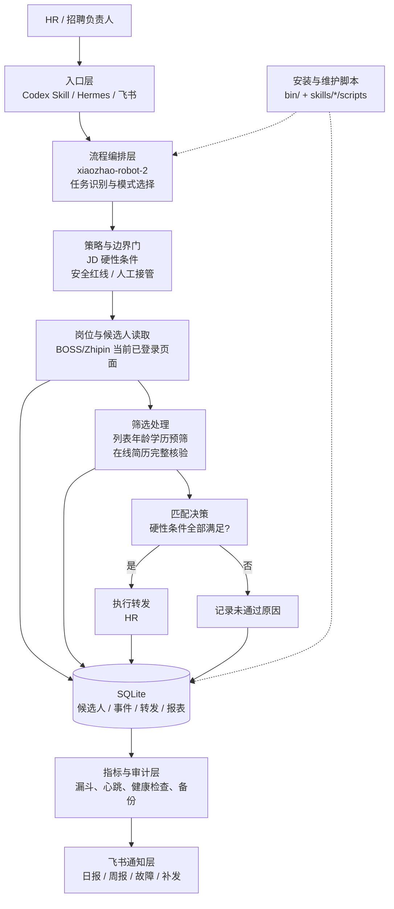
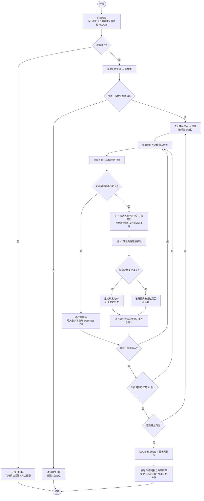
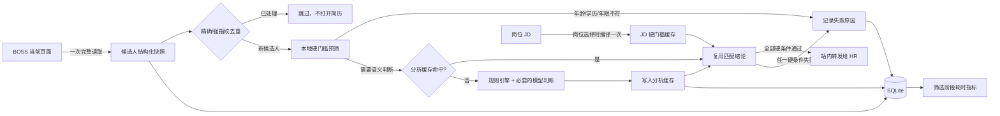

# 小昭招聘机器人 2.2：架构与流程

> 本文把小昭招聘机器人的业务约束、模式选择、系统架构和运行流程集中说明，作为 README 的详细设计文档。
> 文档中的流程图使用 GitHub 原生 Mermaid，可直接在仓库页面查看。

## 1. 项目定位

小昭招聘机器人是一个面向 BOSS/Zhipin HR 筛选场景的**可控招聘工作台**：接收招聘任务和 JD，按照硬性条件筛选推荐候选人，保留可复核的最小数据，满足条件后执行转发，并将过程统计沉淀到 SQLite，最终通过飞书发送日报/周报。

### 1.1 一次任务的完整契约

| 模块 | 必须说明 | 本项目落地方式 |
| --- | --- | --- |
| 角色 | 模型扮演谁、服务什么对象 | HR 招聘助手，服务招聘负责人 |
| 背景 | 业务背景和输入来源 | 用户任务、开放岗位、用户提供的 JD 库、BOSS 推荐候选人 |
| 目标 | 本轮必须完成的动作 | 识别岗位、筛选候选人、依据硬性条件给出结论，必要时转发 |
| 依据 | 允许使用哪些材料、优先级如何 | JD 库 > 在线简历直接证据 > 列表字段；缺少直接证据不判定为满足 |
| 步骤 | 按什么顺序处理 | 启动检查 → 岗位校验 → 批量预筛 → 在线简历核验 → 匹配/转发 → 记录/报告 |
| 边界 | 不能做什么、何时停止 | 不猜测政策、不承诺录用、不处理验证码/安全验证、不保存简历全文 |
| 输出 | 输出格式、字段和下一步 | `结论 / 依据 / 下一步`，同时写入 SQLite 事件与统计 |

## 2. 模式选择

不同任务不应强行使用同一种 Agent 组织方式。小昭的日常筛选属于**固定工作流模式**，不是为了追求“多 Agent”而拆分流程。

| 判断信号 | 典型表现 | 优先模式 | 小昭中的对应场景 |
| --- | --- | --- | --- |
| 流程是否固定 | 步骤清楚、每次按同一路径执行 | 单工作流模式 | BOSS 推荐牛人筛选主流程 |
| 答案是否需要稳定溯源 | 制度、产品、政策、FAQ，答案要可信可引用 | 标准模式 | JD 硬性要求、规则说明、日报数据契约 |
| 是否需要角色协作 | 需要调研、分析、复核、写作、风控等分工 | Multi-Agent 模式 | 仅在未来的复杂招聘研究/复盘任务中启用 |
| 是否需要操作文件或代码 | 读写文件、生成文档、运行代码、处理 Excel，路径不固定 | Claw 模式 | 安装、打包、SQLite 检查、报表生成 |
| 是否还在探索需求 | 快速生成应用初稿，技术用户希望通过对话搭建 | 智能工作台入口 | 作为产品入口/扩展方向，不改变生产筛选主链路 |

**当前决策：**生产筛选使用“单工作流 + 标准依据 + 可审计存储”；文件、代码和报表操作由脚本技能承接；只有出现明确的多角色协作需求时才引入 Multi-Agent。

## 3. 总体架构



### 3.1 分层职责

| 层 | 责任 | 关键约束 |
| --- | --- | --- |
| 入口层 | 接收自然语言任务、加载技能 | 对外只暴露 `xiaozhao-robot-2` 入口 |
| 编排层 | 识别任务、按顺序调度子技能 | 正常筛选不跳过检查和持久化步骤 |
| 策略与边界门 | 解释 JD、判断是否需要人工接管 | 缺少直接证据视为未满足；风险操作停止 |
| 浏览器交互层 | 读取岗位、候选人和在线简历 | 只使用用户已有的 BOSS 页面和受支持的可见控制路径 |
| 数据层 | 去重、记录事件、聚合日报周报 | SQLite 是唯一持久化源，不写 JSON/JSONL |
| 观测与通知层 | 健康检查、指标、备份、飞书发送 | 报告可补发，发送失败不丢正文 |

## 4. 标准筛选流程



### 4.1 决策顺序

1. **先校验前置条件**：模型、运行窗口、自动化心跳、SQLite 状态和已有进程。
2. **再校验岗位资料**：只读取开放岗位，和用户提供的 JD 库比对；不在正常流程中抓取或覆盖 JD。
3. **列表阶段只做轻量判断**：只依据可见的年龄、学历和 SQLite 查重结果决定是否打开在线简历。
4. **在线简历阶段做完整判断**：必须读到当前候选人的简历底部，逐项核验硬性要求；缺少直接证据视为未满足。
5. **最后执行动作**：全部硬性条件满足才转发；任何高风险、无法确认或安全验证都转人工。

## 5. 输出和证据格式

每个候选人的业务结果按以下结构表达，避免只输出“合适/不合适”：

```text
结论：通过 / 不通过 / 需人工复核
依据：硬性条件逐项结果 + 对应直接证据或缺失证据
下一步：转发 / 不转发 / 补充资料 / 人工接管
```

同时写入 SQLite 的最小记录：

- 全局查重：岗位、姓名、年龄、学历、规范化 `candidate_key`。
- 过程事件：列表读取、预筛、打开在线简历、匹配结果、转发结果、阻断原因。
- 报表指标：岗位总数据、列表读取、重复、列表弃选、在线简历查看、入库、转发、未转发。

## 6. 可靠性与治理能力

| 能力 | 目标 | 本项目落地 |
| --- | --- | --- |
| 可控性 | 系统始终受人类掌控，可暂停、停止并设置权限边界 | 启动检查、运行窗口、风险操作转人工、明确安全红线 |
| 可观测性 | 能验证 Agent 是否按预期工作并重现问题 | 运行事件、心跳、漏斗指标、健康检查、日志 |
| 可审计性 | 每个决策和动作都有完整、可回溯记录 | SQLite 事件、候选人去重记录、转发记录、报告预整理 |
| 可运维性 | 容易监控、调试、升级和回滚 | 自动备份、WAL/锁检查、故障告警、失败报告补发 |
| 可复用性 | 知识、工具、规则和模板可被多个任务复用 | 子技能树、JD 库、报表脚本、数据契约、自动化模板 |
| 可集成性 | 能接入既有系统而不是孤立运行 | BOSS/Zhipin、SQLite、飞书、Codex、Hermes 的明确接口 |

## 7. 仓库结构

```text
.
├── README.md                         # GitHub 首页：定位、架构图、流程图、快速入口
├── docs/
│   ├── architecture.md               # 本文：设计说明与治理模型
│   ├── diagrams/                     # Mermaid 源图，可复制到其他文档
│   ├── 小昭机器人2.0说明.md            # 当前业务规则与运行口径
│   ├── boss技能树.md                  # 子技能依赖关系
│   └── daily-report-data-contract.md  # 报表字段与交叉校验契约
├── skills/
│   ├── xiaozhao-robot-2/              # 对外唯一入口技能
│   └── zhipin-*/                     # BOSS 业务子技能与脚本
├── hermes/                            # Hermes 侧技能和 slash bundle
├── automations/                       # 自动化任务模板
└── bin/                               # 安装、打包、运维脚本
```

## 8. 安全边界

- 不承诺录用、薪资、退款或任何未经授权的业务结果。
- 不处理验证码、滑动验证、安全验证和账号异常；出现即停止并通知人工。
- 不使用 BOSS 页面红点判断重复，只使用 SQLite 规范化查重记录。
- 不保存简历全文，不在正常筛选中落盘 JSON/JSONL。
- 不停止无关浏览器、系统、Codex、Hermes 或用户进程。
- 模型不可用时不启动 BOSS 自动筛选，先发送独立风险提醒。

## 9. 变更约定

变更筛选规则时，至少同步检查：

1. `skills/xiaozhao-robot-2/SKILL.md` 的入口规则；
2. `skills/zhipin-*` 对应子技能和脚本；
3. `docs/daily-report-data-contract.md` 的字段来源；
4. `README.md` 与本文架构/流程图；
5. `MANIFEST.md`、自动化模板和安装脚本。

这样可以避免“代码已经变了，但仓库说明仍然描述旧流程”。
## 8. 性能优化架构

当前筛选链路采用“浏览器串行、规则优先、结构化缓存、SQLite 权威存储”的优化策略：



### 8.1 已落地的优化

- `job_hard_gates` 增加 `jd_version`、`matcher_version`、`compiled_at`，岗位规则在岗位切换时编译并缓存。
- 增加 `candidate_analysis_cache`，缓存键为候选人结构化快照、岗位版本和匹配器版本。
- 增加 `screening_stage_metrics`，记录在线简历读取、JD 匹配、数据库写入等阶段耗时。
- 列表预筛更新最小候选人索引时，不再删除已有结构化分析结果，避免重复分析。
- `screening_metrics.py` 可生成按阶段的耗时、缓存命中和模型调用统计。
- 浏览器操作仍保持串行；优化目标是减少打开次数和重复分析，而不是并发点击 BOSS。

### 8.2 推荐的候选人去重层级

```text
稳定来源 ID
  ↓
结构化强指纹：姓名 + 年龄 + 学历 + 城市 + 目标岗位 + 工作年限
  ↓
FTS/相似度召回疑似重复
  ↓
人工复核
```

向量数据库暂不作为唯一去重依据。SQLite 是权威事实源，FTS5 或向量索引只用于辅助召回和历史候选人搜索。

### 8.3 性能指标

可使用以下命令查看某一天的阶段指标：

```bash
python skills/zhipin-boss-recruitment-bot/scripts/screening_metrics.py report --day 2026-09-21
```

重点观察：平均每位候选人耗时、浏览器操作次数、模型调用次数、JD 匹配缓存命中率、重复候选人跳过率和在线简历打开率。
